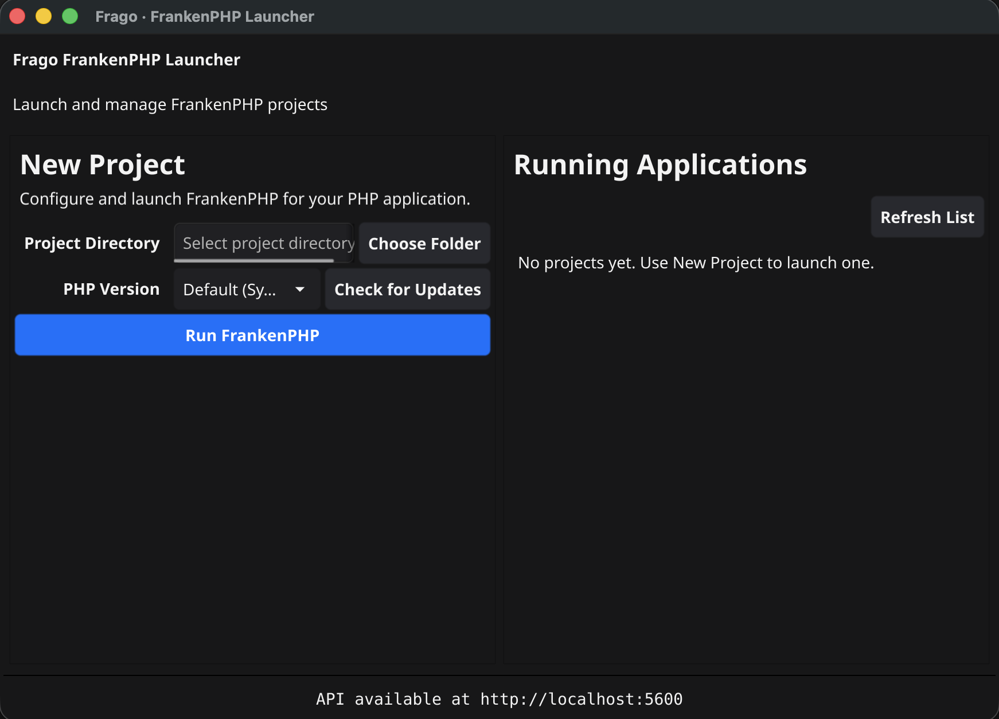

# Frago

**Frago** is a lightweight, cross-platform GUI manager for running PHP applications using [FrankenPHP](https://frankenphp.dev/). Built with Go and [Fyne](https://fyne.io/), it simplifies the local development workflow by managing FrankenPHP processes, ports, and configurations automatically.



## Features

- 🚀 **Easy Process Management**: Start, stop, and manage multiple PHP applications from a single dashboard.
- 🐘 **FrankenPHP Integration**: 
  - Supports bundled FrankenPHP binaries (no separate installation required).
  - Automatically detects system-installed PHP/FrankenPHP versions.
  - Allows selecting specific PHP versions per project.
- 🔌 **Automatic Port Management**: 
  - Automatically finds free ports for your applications.
  - Prevents conflicts between running projects and other system applications.
- 🎯 **Custom Port Selection**: Set a preferred port per project with conflict warnings.
- 📄 **Zero-Config Caddyfile**: Automatically generates and manages `Caddyfile` configurations for your projects.
- 🔄 **Auto-Refresh Status**: Periodic UI updates for running/stopped status.
- ▶️ **Auto-Start & Start All**: Toggle auto-start per project and launch all saved projects at once.
- ⏹ **Stop All**: Stop all running projects with a confirmation prompt.
- 🧭 **System Tray Controls**: Quick start/stop and recent projects menu.
- 📋 **Project Logs**: View, copy, and export recent logs per project.
- 🩺 **Health Status**: Health indicator with quick restart for unhealthy/failed processes.
- 📈 **Process Stats**: View CPU and RAM usage for running projects.
- 📂 **Open Folder**: Jump to a project directory from the list.
- 🛠 **Developer Friendly**: "Open in Browser" shortcuts and quick management actions.

## Prerequisites

- **Go**: Version 1.22 or higher.
- **FrankenPHP**: 
  - Frago checks for a bundled `frankenphp` binary in the same directory.
  - Alternatively, it can use a globally installed `frankenphp` from your system PATH.

## Installation

### From Source

1. Clone the repository:
   ```bash
   git clone https://github.com/devmarvs/frago.git
   cd frago
   ```

2. Run the application directly:
   ```bash
   go run .
   ```

3. Or build a binary:
   ```bash
   go build -o frago .
   ./frago
   ```

## Usage

1. **Add a Project**:
   - Click **Choose Folder**.
   - Select the root directory of your PHP project (where your `index.php` or `public/` folder resides).

2. **Configure**:
   - Select the desired **PHP Version** from the dropdown (if multiple are detected).
   - Optionally set a **Port**; Frago will warn if it is already in use.
   - Frago defaults to using the bundled FrankenPHP binary if available.

3. **Run**:
   - Click **"Run FrankenPHP"** to start the server.
   - Frago will assign a port (e.g., `localhost:8080`) and launch the application.
   - Click **"Open"** to view it in your browser.

4. **Manage**:
   - **Open**: Launches the running site in your browser.
   - **Stop**: Halts the FrankenPHP process.
   - **Run**: Starts a stopped project again.
   - **Delete**: Removes a stopped project from the list and deletes its `Caddyfile`.
   - **Auto-start**: Toggle to automatically run a project on app launch.
   - **Start All**: Launches all saved projects that are not currently running.
   - **Stop All**: Stops all running projects after confirmation.
   - **Logs**: View the latest log lines and copy/export them.
   - **Health**: Shows health status and offers a restart action when unhealthy/failed.
   - **Open Folder**: Opens the project directory in your file manager.
   - **Refresh List**: Manually refreshes the running list (auto-refresh is also enabled).

## Architecture

- **Language**: Go (Golang)
- **GUI Framework**: Fyne
- **Web Server Engine**: FrankenPHP (Caddy-based)
- **Configuration**: Dynamic `Caddyfile` generation in each project directory.

## Project Structure

- `main.go`: Application entry point and UI logic.
- `internal/runner`: Handles process execution, binary detection, and port management.
- `internal/caddy`: Manages Caddyfile generation.
- `internal/server`: HTTP server for internal API/coordination (if applicable).
- `internal/updater`: Checks for FrankenPHP updates via GitHub Releases.

## License

[MIT License](LICENSE)
